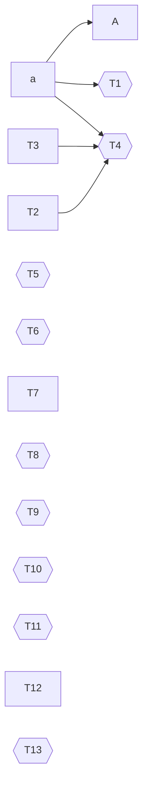

## Notes

Only the first `## Phase table` section is read. The next line is a task item
in another section, so it is not a row.

- [ ] **Z9** Not a row, wrong section: #99

## phase table

The heading match ignores ASCII case. These lines are not rows and are ignored:

- a plain bullet
* [ ] **S1** An asterisk task item: #91
1. [ ] **S2** An ordered task item: #92
  - [ ] **S3** An indented task item: #93
#### A deeper heading does not start a phase

- [X] **a** Upper-case X is done: #1
- [ ] **A** Ids are case-sensitive: #2 · after a

### Titles

- [ ] **T1** The last marker wins · after hours · after a
- [ ] **T2** Parentheses before the ref stay in the title (kept): #3
- [ ] **T3** Nested notes: #4 (see (a) and (b))
- [ ] **T4** Only the last group is notes (title) (notes) · after T3,T2 , a
- [ ] **T5** An unbalanced parenthesis stays in the title :)
- [ ] **T6** Run `deploy()` then verify()
- [ ] **T7**   Extra spaces around the title are trimmed  : example/alpha#5
- [ ] **T8** A ref needs a colon and one space:#6
- [ ] **T9** A bullet dot is not the marker • after a
- [ ] **T10** A number alone is a title: 12
- [ ] **T11** An empty group is not notes ()
- [ ] **T12** Names may use dots, underscores and hyphens: example-org/alpha_beta.rs#7
- [ ] **T13** A number has no leading zero: #007

## Dependency graph

Other lines in this section are ignored by the comparison.

## Phase table

- [ ] **Z8** A second phase table is not read: #98
